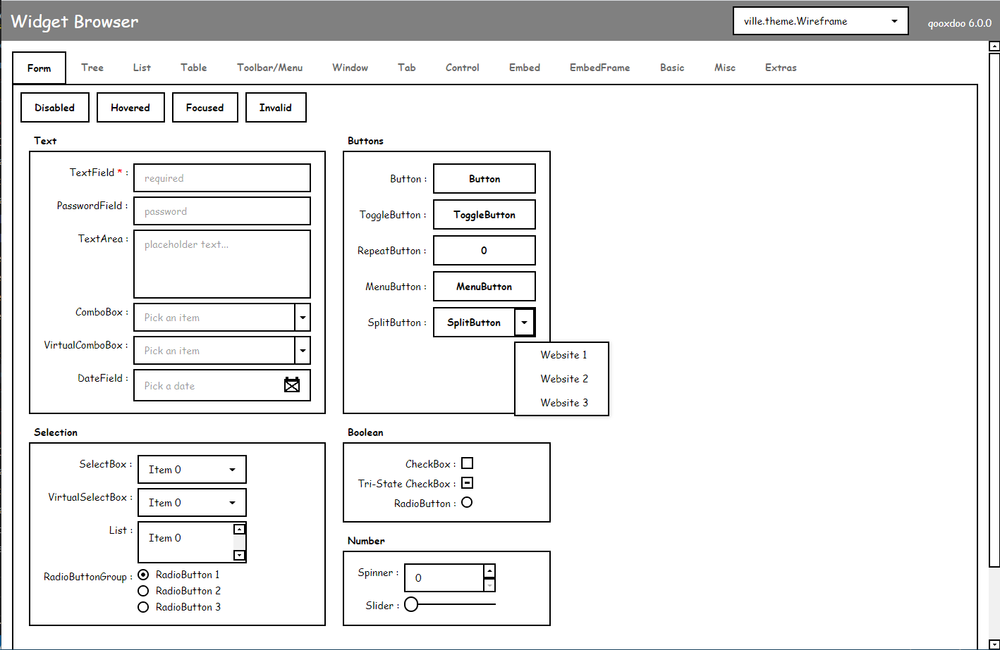
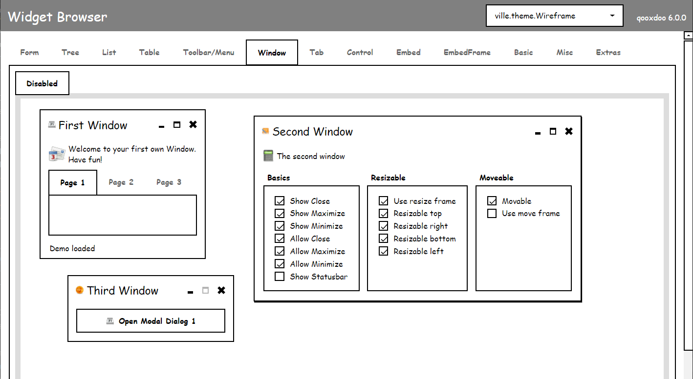
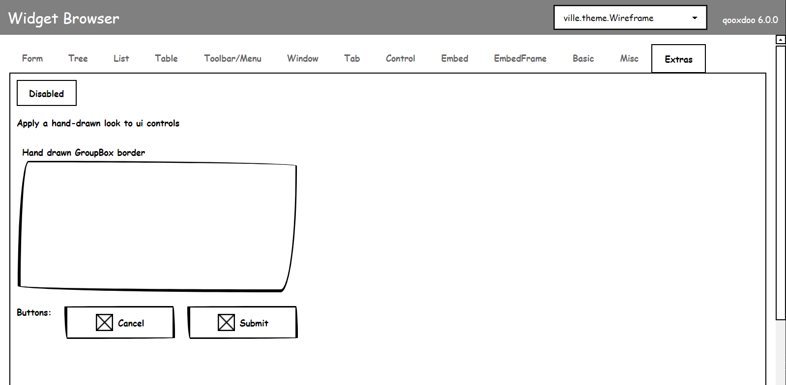

<!-- PROJECT LOGO -->
<br />
<p align="center">
  <a href="https://github.com/sqville/ville.Wireframe">
    
  </a>

  <h3 align="center"></h3>

  <p align="center">
    A theme for the Qooxdoo JavaScript Framework
  </p>
</p>

<!-- ABOUT THE PROJECT -->
## About The Project

**ville.Wireframe** is a [Qooxdoo](https://qooxdoo.org/) theme designed to help bring focus to layout and interaction BEFORE functionality and branding. Pump the brakes. Take it one step at a time. Iterate and gather more focused feedback before increasing your workload. 

**Additional Benefits**
* All the benefits of [ville.Clean](https://github.com/sqville/ville.Clean) 
* Uses web safe fonts as the default fonts (Comic Sans for MS and Apple Chancery for osx)
* Only three colors to deal with - black, white and gray
* Use to build out contorl image repository for mockup/wireframing tools (i.e. Adobe, Figma, Sketch, etc.)
* Examples of how to make borders look hand drawn using only CSS3

## Screen Captures
**From Controls**

**Windows**

**Give boxes a hand drawn look**



<!-- GETTING STARTED -->
## Using the Theme in your Application
To use the Theme in your application, go into the application root directory and install the theme into your project:
```sh
$ qx package update
$ qx package list
$ qx package install sqville/ville.Wireframe
```
now you just have to modify your compile.json to enable the theme:
```sh
"applications": [
  {
    ...
    "theme": "ville.theme.Wireframe",
    ...
  }
],
```

<!-- DEMOS -->
## Demo
Using Qooxdoos WidgetBrowser - TBD

<!-- ROADMAP -->
## Roadmap

TBD


<!-- LICENSE -->
## License

Distributed under the MIT License. See `LICENSE` for more information.


<!-- CONTACT -->
## Contact

Chris Eskew - [@SQville](https://twitter.com/SQville) - email: chris.eskew@sqville.com
